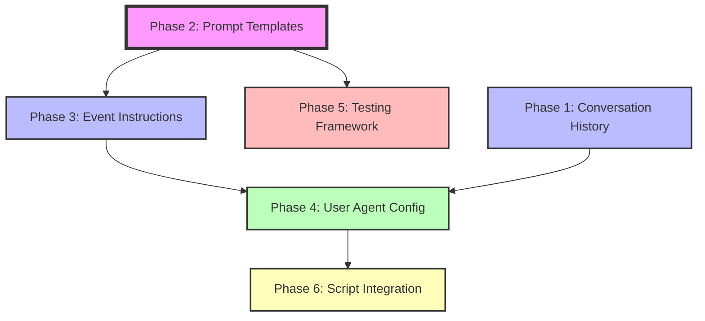

# NetGet Agent Enhancement Plan

## Overview

This document outlines a comprehensive enhancement plan for NetGet's dual-agent architecture, focusing on improving prompt management, adding conversation history, and enabling dynamic agent configuration. The plan is divided into six decoupled phases that can be implemented incrementally.

## Vision

Transform NetGet's agent system from hardcoded prompt strings to a flexible, testable, and configurable architecture where:
- The User Input Agent maintains conversation history and context
- Each network event type has structured, customizable prompt templates
- The User Agent dynamically configures the Network Agent's behavior
- Prompts are external, versionable, and testable
- Scripts can replace LLM responses for deterministic behavior

## Architecture Goals

1. **Conversation Memory**: User Input Agent remembers past interactions and decisions
2. **Structured Prompts**: Consistent format across all agent types (Role → Context → Instructions → Examples → Constraints)
3. **Event-Specific Customization**: Each EventType has default instructions that User Agent can modify
4. **Dynamic Configuration**: User Agent manufactures Network Agent prompts based on user requirements
5. **Testing Framework**: Automated testing for prompt effectiveness and regression detection
6. **Script Integration**: Seamless replacement of LLM with deterministic scripts per event type

## Phase Dependencies



## Implementation Order

### Critical Path (Must be done in order):
1. **Phase 2**: Prompt Template System (Foundation - 1 week)
2. **Phase 3**: Event-Specific Instructions (Builds on templates - 1 week)
3. **Phase 4**: User Agent Configuration (Requires 2+3 - 2 weeks)
4. **Phase 6**: Script Integration (Requires 4 - 1 week)

### Parallel Track:
- **Phase 1**: Conversation History (Can start anytime - 1 week)
- **Phase 5**: Testing Framework (Can start after Phase 2 - 1 week)

## Phase Summaries

### Phase 1: Conversation History
- **Goal**: Add memory to User Input Agent
- **Key Changes**: Store conversation state, include history in prompts
- **Dependencies**: None (can run parallel)
- **Effort**: 1 week
- **Risk**: Low
- [Detailed Plan](phase-1-conversation-history.md)

### Phase 2: Prompt Template System
- **Goal**: Replace hardcoded strings with structured templates
- **Key Changes**: External prompt files, template engine, variable substitution
- **Dependencies**: None (foundation phase)
- **Effort**: 1 week
- **Risk**: Medium (touches all prompt generation)
- [Detailed Plan](phase-2-prompt-template-system.md)

### Phase 3: Event-Specific Instructions
- **Goal**: Default instructions per EventType
- **Key Changes**: Template library for each event, customization points
- **Dependencies**: Phase 2
- **Effort**: 1 week
- **Risk**: Low
- [Detailed Plan](phase-3-event-instructions.md)

### Phase 4: User Agent Configuration
- **Goal**: User Agent dynamically configures Network Agent
- **Key Changes**: Prompt manufacturing, instruction modification, context passing
- **Dependencies**: Phases 1, 2, 3
- **Effort**: 2 weeks
- **Risk**: Medium (core behavior change)
- [Detailed Plan](phase-4-user-agent-config.md)

### Phase 5: Testing Framework
- **Goal**: Automated prompt testing and validation
- **Key Changes**: Test harness, effectiveness metrics, regression detection
- **Dependencies**: Phase 2
- **Effort**: 1 week
- **Risk**: Low
- [Detailed Plan](phase-5-testing-framework.md)

### Phase 6: Script Integration
- **Goal**: Enhanced script replacement per event type
- **Key Changes**: Per-event scripts, script templates, WASM support
- **Dependencies**: Phase 4
- **Effort**: 1 week
- **Risk**: Low (builds on existing scripting)
- [Detailed Plan](phase-6-script-integration.md)

## Success Metrics

### Technical Metrics
- Prompt changes don't require recompilation
- Test coverage for 80% of common scenarios
- Prompt effectiveness measurable and improving
- Response time unchanged or improved

### Developer Experience
- New protocol implementation time reduced by 30%
- Prompt debugging time reduced by 50%
- A/B testing possible without code changes
- Clear documentation and examples

### User Experience
- User Agent remembers context across sessions
- More accurate Network Agent responses
- Ability to fine-tune server behavior
- Predictable scripted responses when needed

## Risk Mitigation

### Backward Compatibility
- All phases maintain backward compatibility
- Feature flags for gradual rollout
- Fallback to old system if issues detected

### Performance
- Template caching for fast prompt generation
- Lazy loading of templates
- Benchmark before/after each phase

### Testing
- Each phase includes comprehensive tests
- Integration tests between phases
- Load testing for template system

## File Structure After Implementation

```
netget/
├── prompts/                          # All prompt templates
│   ├── user_input/                   # User Input Agent prompts
│   │   ├── role.md
│   │   ├── instructions.md
│   │   └── examples/
│   ├── network_request/               # Network Agent prompts
│   │   ├── events/                   # Per-event templates
│   │   │   ├── connection_accepted.md
│   │   │   ├── data_received.md
│   │   │   └── ...
│   │   └── protocols/                # Protocol-specific
│   │       ├── http/
│   │       ├── ssh/
│   │       └── ...
│   └── shared/                       # Shared components
│       ├── constraints.md
│       └── formatting.md
├── src/
│   └── llm/
│       ├── prompt_template.rs        # New: Template engine
│       ├── conversation_state.rs     # New: History management
│       ├── prompt_factory.rs         # New: Prompt manufacturing
│       └── prompt_builder.rs         # Refactored: Uses templates
└── tests/
    └── prompts/                       # Prompt testing
        ├── effectiveness/
        └── regression/
```

## Migration Strategy

1. **Phase 2 First**: Create template system alongside existing code
2. **Gradual Migration**: Move one prompt at a time to templates
3. **Feature Flags**: Use `prompt_templates` feature flag
4. **Parallel Running**: Run old and new systems in parallel initially
5. **Monitoring**: Track metrics to ensure no regression
6. **Cutover**: Remove old system after 2 weeks of stable operation

## Open Questions for Implementation

1. Should conversation history persist across NetGet restarts?
2. What's the maximum conversation history length?
3. Should templates support conditional logic or just variables?
4. How to handle template versioning for A/B testing?
5. Should scripts have access to conversation history?

## Next Steps

1. Review and approve this plan
2. Start with Phase 2 (Prompt Template System) as foundation
3. Implement Phase 1 (Conversation History) in parallel
4. Weekly reviews to adjust plan based on learnings

## Implementation Guide

See [implementation-guide.md](implementation-guide.md) for step-by-step instructions for developers implementing each phase.