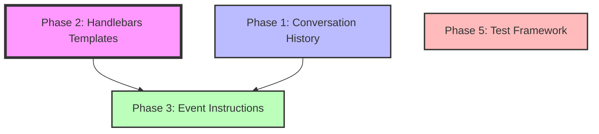

# NetGet Agent Enhancement Plan

## Overview

This document outlines a comprehensive enhancement plan for NetGet's dual-agent architecture, focusing on improving prompt management, adding conversation history, simplifying event instructions, and creating a robust E2E test framework. The plan is divided into four phases that can be implemented incrementally.

## Vision

Transform NetGet's agent system from hardcoded prompt strings to a flexible, testable, and configurable architecture where:
- The User Input Agent maintains conversation history (limited by token size)
- Prompts use Handlebars templates with partials for composition
- Each EventType has simple default instructions that can be overridden
- E2E tests are split into reusable validators and simple executors
- The existing script system continues to provide deterministic responses

## Phase Dependencies



## Implementation Order

### Critical Path:
1. **Phase 2**: Handlebars Template System (Foundation - 1 week)
2. **Phase 3**: Event Instructions (Builds on templates - 1 week)

### Parallel Tracks:
- **Phase 1**: Conversation History (Can start anytime - 1 week)
- **Phase 5**: Test Framework (Can start anytime - 1 week)

## Phase Summaries

### Phase 1: Conversation History
- **Goal**: Add token-limited memory to User Input Agent
- **Key Changes**: Track user inputs, LLM responses, retry messages, tool calls
- **Token Management**: Character-based size limit with truncation indicator
- **Content**: Only essential messages (no file contents or verbose tool outputs)
- **Effort**: 1 week
- **Risk**: Low
- [Detailed Plan](phase-1-conversation-history.md)

### Phase 2: Handlebars Template System
- **Goal**: Replace hardcoded strings with Handlebars templates
- **Key Changes**: External template files, partials for composition, examples as separate files
- **Templates**: User input and network request prompts with Phase 3 fields
- **Testing**: Migrate snapshot tests to use templates
- **Effort**: 1 week
- **Risk**: Medium (touches all prompt generation)
- [Detailed Plan](phase-2-prompt-template-system.md)

### Phase 3: Event Instructions & Configuration
- **Goal**: Simple default instructions per EventType with override capability
- **Key Changes**: Default instructions registry, global + event-specific overrides
- **Priority**: Script → Event Override → Default
- **Structure**: Simple string instructions + optional examples
- **Effort**: 1 week
- **Risk**: Low
- [Detailed Plan](phase-3-event-instructions.md)

### Phase 5: E2E Test Framework
- **Goal**: Split tests into validators and simple direct test flow
- **Validators**: Protocol client wrappers with assertion helpers
- **Direct Tests**: Simple imperative test flow without framework abstractions
- **NetGet Wrapper**: Extended control capabilities for testing
- **Effort**: 1 week
- **Risk**: Low
- [Detailed Plan](phase-5-test-framework.md)

## Success Metrics

### Technical Metrics
- Prompt changes don't require recompilation
- Test coverage for common scenarios
- Conversation history properly bounded by tokens
- E2E tests simplified and more reliable

### Developer Experience
- New protocol implementation time reduced
- Prompts easily editable in template files
- Tests easy to write with validators
- Clear separation of concerns

### User Experience
- User Agent remembers conversation context
- More accurate Network Agent responses via better instructions
- Ability to customize server behavior
- Existing script system still works

## Risk Mitigation

### Backward Compatibility
- All phases maintain backward compatibility
- Feature flags for gradual rollout
- Existing script system unchanged

### Performance
- Template caching for fast rendering
- Token-based history limits prevent memory issues
- Lazy loading where appropriate

### Testing
- Each phase includes comprehensive tests
- Snapshot tests ensure templates produce correct output
- E2E tests validate end-to-end behavior

## File Structure After Implementation

```
netget/
├── prompts/                          # Handlebars templates
│   ├── user_input/
│   │   ├── main.hbs
│   │   ├── partials/
│   │   └── examples/
│   ├── network_request/
│   │   ├── main.hbs
│   │   ├── partials/
│   │   └── events/
│   ├── defaults/                     # Default event instructions
│   │   ├── http/
│   │   ├── ssh/
│   │   └── tcp/
│   └── shared/
├── src/
│   └── llm/
│       ├── template_engine.rs        # Handlebars engine
│       ├── conversation_state.rs     # Conversation history
│       ├── event_instructions.rs     # Event instruction types
│       └── default_instructions.rs   # Default registry
└── tests/
    ├── validators/                    # Protocol validators
    │   ├── http_validator.rs
    │   ├── ssh_validator.rs
    │   └── tcp_validator.rs
    └── e2e/
        ├── netget_wrapper.rs         # Extended NetGet wrapper
        ├── http_tests.rs             # HTTP server tests
        ├── ssh_tests.rs              # SSH server tests
        └── tcp_tests.rs              # TCP server tests
```

## Key Simplifications from Original Plan

1. **Conversation History**: Only essential messages, token-based limits, no complex context tracking
2. **Templates**: Using Handlebars with partials instead of custom engine
3. **Event Instructions**: Simple string + examples instead of complex structure
4. **No Phase 4**: User Agent configuration merged into Phase 3
5. **No Phase 6**: Scripting already exists
6. **Test Framework**: Simple direct approach with validators, no complex test abstractions

## Next Steps

1. Review this updated plan
2. Start with Phase 2 (Handlebars Templates) as foundation
3. Implement Phase 1 (Conversation History) in parallel
4. Build Phase 3 on top of Phase 2
5. Implement Phase 5 (Test Framework) independently

## Implementation Guide

See [implementation-guide.md](implementation-guide.md) for step-by-step instructions for developers implementing each phase.