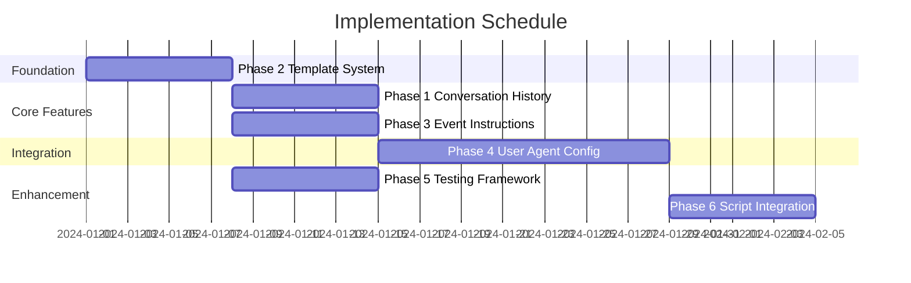

# NetGet Agent Enhancement Implementation Guide

## Overview

This guide provides step-by-step instructions for implementing the NetGet agent enhancement plan. The implementation is divided into 6 phases that can be executed incrementally, with clear dependencies and integration points.

## Prerequisites

Before starting implementation:

1. **Development Environment**:
   - Rust 1.75+ with async support
   - Ollama installed and configured
   - Git for version control
   - Cargo with workspace support

2. **Understanding Required**:
   - Current NetGet architecture
   - Tokio async runtime
   - LLM prompt engineering basics
   - Rust trait system

3. **Codebase Familiarity**:
   - `src/llm/` - Current prompt and agent system
   - `src/server/` - Protocol implementations
   - `src/protocol/` - BaseStack definitions
   - `src/state/` - Application state management

## Implementation Timeline



## Phase 2: Prompt Template System (Week 1)

**Goal**: Foundation for all other phases

### Day 1-2: Core Template Engine

1. **Create new module structure**:
```bash
mkdir -p src/llm/templates
mkdir -p prompts/{user_input,network_request,shared}
```

2. **Implement `template_engine.rs`**:
```rust
// Start with basic template loading and variable substitution
pub struct TemplateEngine {
    templates: HashMap<String, Template>,
    loader: Box<dyn TemplateLoader>,
}
```

3. **Key functions to implement**:
   - `load_template()` - Load from file system
   - `render()` - Variable substitution
   - `validate()` - Check required variables

### Day 3-4: Extract Current Prompts

1. **Analyze `prompt_builder.rs`**:
   - Identify all prompt sections
   - Document variable requirements
   - Map to new template structure

2. **Create template files**:
```markdown
# prompts/user_input/base.md
# [ROLE]
{{role_description}}

# [CONTEXT]
{{context}}
...
```

3. **Maintain exact content** (no behavior changes yet)

### Day 5-6: Integration

1. **Refactor `PromptBuilder`**:
```rust
impl PromptBuilder {
    pub fn new(engine: Arc<TemplateEngine>) -> Self {
        // Migrate from string concatenation
    }
}
```

2. **Add feature flag**:
```toml
[features]
prompt_templates = []
```

3. **Parallel testing**:
   - Run old and new systems side by side
   - Verify identical output

### Day 7: Testing & Documentation

1. **Unit tests**:
```rust
#[test]
fn test_template_rendering() {
    // Test all template operations
}
```

2. **Performance benchmarks**:
   - Template loading time
   - Rendering performance
   - Memory usage

### Validation Checklist
- [ ] All prompts extracted to files
- [ ] No behavior changes
- [ ] Tests passing
- [ ] Performance acceptable

---

## Phase 3: Event-Specific Instructions (Week 2)

**Goal**: Structure for event-based customization

### Day 1-2: Instruction Registry

1. **Create instruction types**:
```rust
// src/llm/event_instructions.rs
pub struct EventInstructions {
    event_type: EventType,
    base_instructions: InstructionSet,
    customizations: InstructionCustomization,
}
```

2. **Build registry**:
```rust
pub struct EventInstructionRegistry {
    defaults: HashMap<(BaseStack, EventType), InstructionSet>,
}
```

### Day 3-4: Default Instructions

1. **Create YAML definitions**:
```yaml
# prompts/network_request/events/defaults/http/data_received.yaml
event_type: DataReceived
primary_task: "Process HTTP request"
steps:
  - order: 1
    description: "Parse request"
...
```

2. **Load and validate**:
   - Parse YAML files
   - Build instruction sets
   - Validate completeness

### Day 5-6: Customization System

1. **Implement merging logic**:
```rust
pub fn merge_instructions(
    base: &InstructionSet,
    custom: &InstructionCustomization,
) -> InstructionSet
```

2. **Test merging**:
   - Override steps
   - Add new steps
   - Modify constraints

### Day 7: Integration & Testing

1. **Update prompt building**:
   - Include event instructions
   - Format for LLM consumption

2. **Validation**:
   - Each event has instructions
   - Customizations apply correctly

### Validation Checklist
- [ ] All events have default instructions
- [ ] Customization system working
- [ ] Merging logic tested
- [ ] Integration complete

---

## Phase 1: Conversation History (Can run parallel with Phase 3)

**Goal**: Add memory to User Agent

### Day 1-2: State Management

1. **Create `conversation_state.rs`**:
```rust
pub struct ConversationState {
    messages: VecDeque<ConversationMessage>,
    context: ConversationContext,
    max_history_size: usize,
}
```

2. **Implement core operations**:
   - Add messages
   - Maintain rolling window
   - Extract context

### Day 3-4: History Integration

1. **Update `ConversationHandler`**:
```rust
pub struct ConversationHandler {
    conversation_state: Arc<Mutex<ConversationState>>,
    // ... existing fields
}
```

2. **Record interactions**:
   - User messages
   - Assistant responses
   - Executed actions

### Day 5-6: Prompt Enhancement

1. **Include history in prompts**:
```rust
impl PromptBuilder {
    pub fn with_conversation_history(&mut self, history: &ConversationState) {
        // Add history section to prompt
    }
}
```

2. **Format for clarity**:
   - Recent messages first
   - Action results included
   - Context summary

### Day 7: Testing

1. **Multi-turn conversations**:
   - Context references work
   - History maintains correctly
   - Memory limits respected

### Validation Checklist
- [ ] State management working
- [ ] History in prompts
- [ ] Context references functional
- [ ] Performance acceptable

---

## Phase 4: User Agent Configuration (Weeks 3-4)

**Goal**: Dynamic Network Agent configuration

### Week 1: Analysis & Manufacturing

1. **Requirement analyzer**:
```rust
impl UserAgent {
    pub async fn analyze_requirements(&self, input: &str) -> RequirementAnalysis {
        // Extract structured requirements
    }
}
```

2. **Prompt manufacturer**:
```rust
pub struct PromptManufacturer {
    pub fn manufacture(&self, event: &NetworkEvent, config: &AgentConfiguration) -> ManufacturedPrompt
}
```

3. **Configuration builder**:
   - From requirements
   - Per-event customization
   - Validation

### Week 2: Integration & Testing

1. **Dynamic prompt builder**:
```rust
pub struct DynamicPromptBuilder {
    manufacturer: Arc<PromptManufacturer>,
    configuration: Arc<RwLock<AgentConfiguration>>,
}
```

2. **Network Agent integration**:
   - Use manufactured prompts
   - Configuration updates
   - Runtime modifications

3. **End-to-end testing**:
   - User requirements → Configuration
   - Configuration → Prompts
   - Prompts → Behavior

### Validation Checklist
- [ ] Requirements analysis working
- [ ] Manufacturing system complete
- [ ] Configuration transfer functional
- [ ] Network Agent using manufactured prompts
- [ ] Behavior matches specifications

---

## Phase 5: Testing Framework (Week 2-3, parallel after Phase 2)

**Goal**: Prompt validation and regression detection

### Day 1-2: Test Framework Core

1. **Test case structure**:
```yaml
tests:
  - id: create_http_basic
    input:
      trigger: "Start HTTP server on 8080"
    expectations:
      action: open_server
      parameters:
        port: 8080
```

2. **Test runner**:
```rust
pub struct TestRunner {
    pub async fn run_test(&self, test: &PromptTestCase) -> TestResult
}
```

### Day 3-4: Evaluation System

1. **Implement scorers**:
   - Action match
   - Parameter accuracy
   - Semantic similarity

2. **Scoring pipeline**:
   - Run all scorers
   - Aggregate scores
   - Determine pass/fail

### Day 5-6: Regression Detection

1. **Baseline management**:
   - Store results
   - Compare runs
   - Detect degradation

2. **Reporting**:
   - Test results
   - Regression analysis
   - Recommendations

### Day 7: CLI Integration

1. **Test commands**:
```bash
netget test prompts --all
netget test prompts --regression
netget test prompts --ab
```

### Validation Checklist
- [ ] Test cases defined
- [ ] Runner executing tests
- [ ] Evaluation accurate
- [ ] Regression detection working
- [ ] CLI integrated

---

## Phase 6: Script Integration (Week 5)

**Goal**: Enhanced scripting per event

### Day 1-2: Per-Event Scripts

1. **Script configuration**:
```rust
pub struct ScriptConfiguration {
    event_scripts: HashMap<EventType, ScriptDefinition>,
}
```

2. **Script definitions**:
   - Language specification
   - Source management
   - Interface contracts

### Day 3-4: Runtime Manager

1. **Executor implementation**:
```rust
pub trait ScriptExecutor {
    fn execute(&self, script: &ScriptDefinition, context: &ScriptContext) -> Result<ScriptOutput>
}
```

2. **Language support**:
   - JavaScript executor
   - Python executor
   - Go executor
   - WASM executor

### Day 5-6: Template Library

1. **Create templates**:
```javascript
// scripts/templates/http/static_response.js
function handleEvent(event, context) {
    return {
        type: "send_data",
        data: buildResponse({{status_code}}, "{{body}}")
    };
}
```

2. **Script generation**:
   - From templates
   - LLM generation
   - Validation

### Day 7: Integration

1. **Network Agent routing**:
```rust
if let Some(script) = config.get_script_for_event(&event_type) {
    return execute_script(script, context);
}
// Fall back to LLM
```

### Validation Checklist
- [ ] Per-event scripts working
- [ ] All languages supported
- [ ] Templates functional
- [ ] Mixed mode routing
- [ ] Hot reload working

---

## Integration Testing Strategy

After each phase:

1. **Smoke Tests**:
```bash
# Basic functionality
cargo test --features prompt_templates
```

2. **Integration Tests**:
```bash
# Cross-phase functionality
cargo test --all-features integration
```

3. **Performance Tests**:
```bash
# Benchmark before/after
cargo bench
```

4. **E2E Validation**:
```bash
# Real server scenarios
./run_e2e_tests.sh
```

## Rollback Strategy

Each phase should be reversible:

1. **Feature Flags**:
```rust
#[cfg(feature = "prompt_templates")]
mod templates;
```

2. **Dual Mode Operation**:
   - Run old and new in parallel
   - Compare results
   - Switch based on config

3. **Data Migration**:
   - Export old format
   - Import to new format
   - Validate conversion

## Common Pitfalls & Solutions

### Pitfall 1: Breaking Existing Functionality
**Solution**: Always maintain backward compatibility, use feature flags

### Pitfall 2: Performance Regression
**Solution**: Benchmark each phase, optimize critical paths

### Pitfall 3: Complex Dependencies
**Solution**: Follow implementation order, test integration points

### Pitfall 4: LLM Response Variations
**Solution**: Use deterministic prompts for testing, implement retries

### Pitfall 5: Memory Leaks
**Solution**: Bounded data structures, regular cleanup, monitoring

## Success Metrics

Track these metrics throughout implementation:

1. **Code Quality**:
   - Test coverage > 80%
   - No clippy warnings
   - Documentation complete

2. **Performance**:
   - Prompt generation < 10ms
   - Memory usage < 100MB
   - No latency increase

3. **Functionality**:
   - All existing tests pass
   - New features working
   - No regressions detected

4. **Developer Experience**:
   - Easy to modify prompts
   - Clear error messages
   - Good debugging tools

## Post-Implementation

After all phases complete:

1. **Documentation Update**:
   - Update README.md
   - API documentation
   - Usage examples

2. **Performance Tuning**:
   - Profile hot paths
   - Optimize critical sections
   - Cache where beneficial

3. **User Testing**:
   - Beta release
   - Gather feedback
   - Iterate on issues

4. **Maintenance Plan**:
   - Regular testing
   - Prompt updates
   - Feature additions

## Support & Resources

- **Questions**: Open issue in repository
- **Discussions**: Project Discord/Slack
- **Documentation**: See phase-specific docs
- **Examples**: `examples/` directory

## Final Checklist

Before considering implementation complete:

- [ ] All 6 phases implemented
- [ ] Integration tests passing
- [ ] Performance benchmarks met
- [ ] Documentation updated
- [ ] Migration guide written
- [ ] Rollback tested
- [ ] User feedback incorporated
- [ ] Production ready

## Appendix: Quick Commands

```bash
# Run specific phase tests
cargo test --features phase_1
cargo test --features phase_2

# Full integration test
cargo test --all-features

# Benchmarks
cargo bench --features prompt_templates

# Build with all enhancements
cargo build --release --all-features

# Run with new features
./target/release/netget --use-templates --enable-history

# Rollback to previous version
git checkout v1.0.0
cargo build --release
```