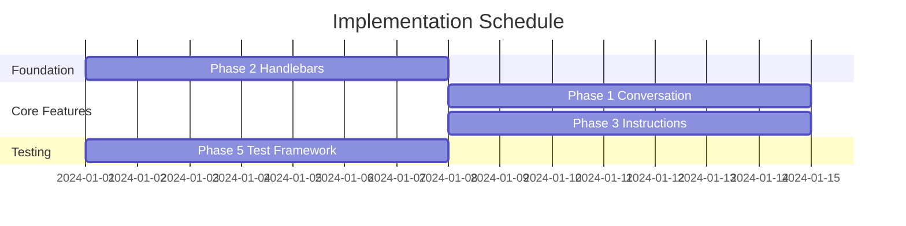

# NetGet Agent Enhancement Implementation Guide

## Overview

This guide provides step-by-step instructions for implementing the NetGet agent enhancement plan. The implementation is divided into 4 phases (reduced from 6) that can be executed incrementally.

## Prerequisites

Before starting implementation:

1. **Development Environment**:
   - Rust 1.75+ with async support
   - Ollama installed and configured
   - Git for version control
   - Cargo with workspace support

2. **Understanding Required**:
   - Current NetGet architecture
   - Tokio async runtime
   - Handlebars templating
   - LLM prompt engineering basics

3. **Codebase Familiarity**:
   - `src/llm/` - Current prompt and agent system
   - `src/server/` - Protocol implementations
   - `src/protocol/` - BaseStack definitions
   - `tests/` - Existing test structure

## Implementation Timeline



## Phase 2: Handlebars Template System (Week 1)

**Goal**: Foundation for all prompt management

### Day 1-2: Setup Handlebars

1. **Add dependencies**:
```toml
# Cargo.toml
[dependencies]
handlebars = "5.1"
walkdir = "2.4"
```

2. **Create template engine**:
```rust
// src/llm/template_engine.rs
pub struct TemplateEngine {
    handlebars: Handlebars<'static>,
    template_dir: PathBuf,
}
```

3. **Setup directory structure**:
```bash
mkdir -p prompts/{user_input,network_request,shared,defaults}
mkdir -p prompts/user_input/{partials,examples}
mkdir -p prompts/network_request/{partials,events}
```

### Day 3-4: Extract Current Prompts

1. **Analyze `prompt_builder.rs`**:
   - Identify all prompt sections
   - Map to Handlebars templates
   - Create partials for reusable sections

2. **Create template files**:
```handlebars
{{!-- prompts/user_input/main.hbs --}}
{{> user_input::partials::role }}

{{#if conversation_history}}
## Conversation History
{{conversation_history}}
{{/if}}

{{> user_input::partials::instructions }}
```

3. **Maintain exact prompt content** (no changes yet)

### Day 5-6: Integration

1. **Refactor PromptBuilder**:
```rust
impl PromptBuilder {
    pub fn new(engine: Arc<TemplateEngine>) -> Self
    pub fn build_user_input_prompt(&self, ...) -> Result<String>
    pub fn build_network_prompt(&self, ...) -> Result<String>
}
```

2. **Include Phase 3 fields** in templates:
   - `global_instructions`
   - `event_instructions`
   - `examples`

### Day 7: Testing

1. **Migrate snapshot tests**:
```rust
#[test]
fn test_template_output_matches_snapshot() {
    let prompt = builder.build_user_input_prompt(...);
    insta::assert_snapshot!(prompt);
}
```

2. **Verify identical output** with old system

### Validation Checklist
- [ ] Handlebars engine working
- [ ] All prompts extracted to templates
- [ ] Partials for composition
- [ ] Examples in separate files
- [ ] Snapshot tests passing
- [ ] Phase 3 fields supported

---

## Phase 1: Conversation History (Week 1-2, parallel)

**Goal**: Add token-limited memory to User Agent

### Day 1-2: State Management

1. **Create conversation state**:
```rust
// src/llm/conversation_state.rs
pub struct ConversationState {
    messages: VecDeque<ConversationMessage>,
    max_token_size: usize,
    current_size: usize,
    truncated: bool,
}
```

2. **Implement message types**:
   - UserInput
   - LLMResponse (with raw output if invalid JSON)
   - RetryInstruction
   - ToolCall (name and brief description only)

### Day 3-4: Integration

1. **Update ConversationHandler**:
```rust
pub struct ConversationHandler {
    conversation_state: Arc<Mutex<ConversationState>>,
    // existing fields...
}
```

2. **Track messages**:
   - Add user inputs before processing
   - Record LLM responses with raw output
   - Track retry instructions
   - Log tool calls (without full content)

### Day 5-6: Token Management

1. **Implement size limits**:
```rust
impl ConversationState {
    pub fn add_message(&mut self, msg: ConversationMessage) {
        while self.current_size + msg.len() > self.max_token_size {
            // Remove oldest messages
            self.truncated = true;
        }
    }
}
```

2. **Format for prompts**:
   - Include truncation notice if needed
   - Clear role prefixes
   - Show raw LLM output when JSON invalid

### Day 7: Testing

1. **Test scenarios**:
   - Message tracking
   - Token limit enforcement
   - Truncation handling
   - History formatting

### Validation Checklist
- [ ] Conversation state implemented
- [ ] Messages tracked correctly
- [ ] Token limits enforced
- [ ] Truncation indicator working
- [ ] History in prompts

---

## Phase 3: Event Instructions (Week 2)

**Goal**: Simple default instructions with override capability

### Day 1-2: Core Types

1. **Define structures**:
```rust
// src/llm/event_instructions.rs
pub struct EventInstructions {
    pub instructions: String,
    pub examples: Vec<Example>,
}

pub struct Example {
    pub input: String,
    pub output: String,
}
```

2. **Create configuration**:
```rust
pub struct ServerInstructionConfig {
    pub global_instructions: Option<String>,
    pub event_overrides: HashMap<EventType, EventInstructions>,
    pub scripts: HashMap<EventType, ScriptConfig>, // existing
}
```

### Day 3-4: Default Registry

1. **Build defaults**:
```rust
// src/llm/default_instructions.rs
impl DefaultInstructionsRegistry {
    pub fn new() -> Self {
        // Add defaults for each protocol/event
    }
}
```

2. **Create YAML defaults**:
```yaml
# prompts/defaults/http/data_received.yaml
instructions: |
  Parse HTTP request.
  Return appropriate response.
examples:
  - input: "GET /"
    output: '{"type": "send_data", ...}'
```

### Day 5-6: Agent Integration

1. **User Agent configuration**:
```rust
impl UserAgent {
    pub fn configure_server_instructions(&self, input: &str)
        -> ServerInstructionConfig
}
```

2. **Network Agent priority**:
   - Check scripts first
   - Use event override if present
   - Fall back to defaults

### Day 7: Testing

1. **Test priority chain**:
   - Script takes precedence
   - Override over default
   - Default as fallback

### Validation Checklist
- [ ] EventInstructions types defined
- [ ] Default registry working
- [ ] User Agent configuration
- [ ] Network Agent uses instructions
- [ ] Priority chain correct

---

## Phase 5: E2E Test Framework (Week 1, parallel)

**Goal**: Split tests into validators and executors

### Day 1-2: Protocol Validators

1. **Create validators**:
```rust
// tests/validators/http_validator.rs
pub struct HttpValidator {
    pub async fn expect_status(&self, path: &str, status: StatusCode)
    pub async fn expect_json(&self, path: &str, json: Value)
    pub async fn expect_contains(&self, path: &str, text: &str)
}
```

2. **Implement for each protocol**:
   - HTTP validator
   - SSH validator
   - TCP validator

### Day 3-4: NetGet Wrapper

1. **Extend wrapper**:
```rust
// tests/e2e/netget_wrapper.rs
pub struct NetGetWrapper {
    pub async fn send_user_input(&mut self, input: &str)
    pub async fn create_server(&mut self, prompt: &str) -> ServerInfo
    pub fn get_server_port(&self, id: &str) -> Option<u16>
    pub fn get_output(&self) -> String
}
```

2. **Add control features**:
   - Wait for completion
   - Parse server creation
   - Track server status

### Day 5-6: Write Tests Directly

1. **Create test structure**:
```rust
// tests/e2e/http_test.rs
#[tokio::test]
async fn test_http_server() {
    let mut netget = NetGetWrapper::new();
    netget.start("model", vec![]).await.unwrap();

    let server = netget.create_server("...").await.unwrap();
    let validator = HttpValidator::new(server.port);

    // Direct assertions
    let response = validator.get("/").await.unwrap();
    assert_eq!(response.status(), StatusCode::OK);
}
```

2. **Simple test flow**:
   - Start NetGet
   - Create server
   - Create validator
   - Make requests and assert

### Day 7: Migration

1. **Migrate existing tests**:
   - Extract validators
   - Simplify test logic
   - Use new format

### Validation Checklist
- [ ] Validators implemented
- [ ] NetGet wrapper extended
- [ ] Tests using validators directly
- [ ] Tests migrated to new approach
- [ ] Tests more readable

---

## Integration Testing Strategy

After each phase:

1. **Unit Tests**:
```bash
cargo test --lib
```

2. **Integration Tests**:
```bash
cargo test integration
```

3. **E2E Validation**:
```bash
cargo test e2e
```

## Rollback Strategy

Each phase should be reversible:

1. **Feature Flags**:
```rust
#[cfg(feature = "handlebars_templates")]
mod template_engine;
```

2. **Parallel Operation**:
   - Run old and new systems together
   - Compare outputs
   - Switch based on config

## Common Pitfalls & Solutions

### Pitfall 1: Breaking Existing Functionality
**Solution**: Feature flags, maintain backward compatibility

### Pitfall 2: Token Limit Issues
**Solution**: Character-based counting, clear truncation

### Pitfall 3: Template Errors
**Solution**: Validate templates on load, good error messages

### Pitfall 4: Test Flakiness
**Solution**: Proper waits, deterministic validators

## Success Metrics

Track these throughout:

1. **Code Quality**:
   - Test coverage maintained
   - No clippy warnings
   - Documentation complete

2. **Performance**:
   - Template rendering < 10ms
   - History management < 5ms
   - No memory leaks

3. **Functionality**:
   - All existing tests pass
   - New features working
   - No regressions

## Post-Implementation

After all phases:

1. **Documentation Update**:
   - Update main README
   - Template documentation
   - Test writing guide

2. **Performance Tuning**:
   - Profile hot paths
   - Optimize templates
   - Cache where needed

3. **User Testing**:
   - Beta release
   - Gather feedback
   - Iterate

## Final Checklist

Before considering complete:

- [ ] Phase 2: Handlebars templates implemented
- [ ] Phase 1: Conversation history working
- [ ] Phase 3: Event instructions functional
- [ ] Phase 5: Test validators and wrapper operational
- [ ] All tests passing
- [ ] Documentation updated
- [ ] Performance acceptable
- [ ] Backward compatible

## Quick Commands

```bash
# Run specific phase tests
cargo test --features handlebars_templates
cargo test conversation_history

# Build with new features
cargo build --release --features "handlebars_templates conversation_history"

# Run E2E tests with validators
cargo test --test e2e_tests

# Check templates
ls -la prompts/

# Test with specific model
OLLAMA_MODEL=qwen2.5-coder:7b cargo test
```